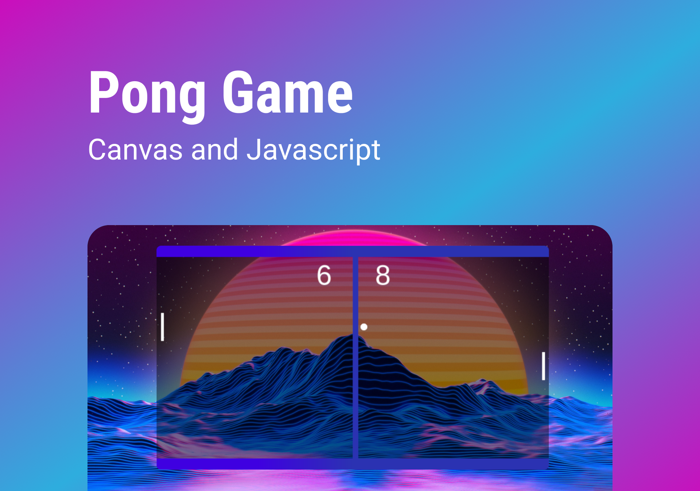

# Pong Game | Canvas and Javascript

> Pong multiplayer game. I used the HTML5 `canvas` element and its JavaScript API to manipulate images, control audio streams and draw graphics animations. > I also used the vanilla-tilt.js script to add the effect of a smooth 3D tilt.
